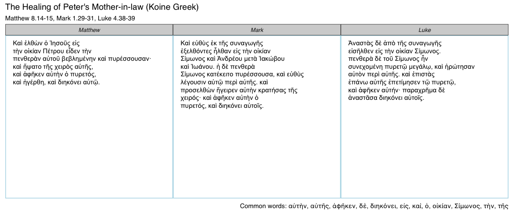
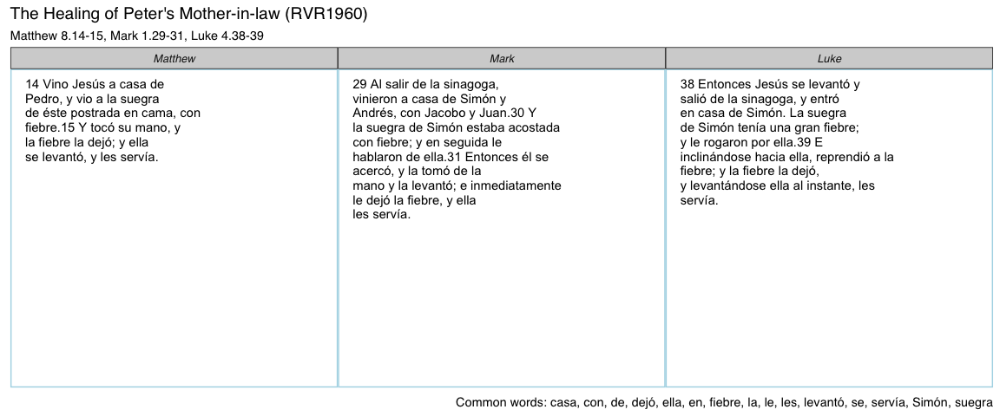

<!-- README.md is generated from README.Rmd. Please edit that file -->
ggtextparallels
===============

The goal of ggtextparallels is to approximate fancy and expensive tools like the *Synopsis Quattuor Evangeliorum*, an essential tool for biblical scholars. Thanks to the people at [BibleSearch](http://bibles.org/eng-GNTD/Gen/1) `ggtextparallels` now supports over 300 versions across 277 languages.

Installation
------------

`ggtextparallels` is not on CRAN, but can be installed with `devtools`:

``` r
devtools::install_github("daranzolin/ggtextparallels")
library(ggtextparallels)
```

Preparation
-----------

`ggtextparallels` relies on two APIs: the Perseus Digital Library and BibleSearch. An API key is required to access the versions and translations from BibleSearch, but [you can obtain one free here.](http://bibles.org/pages/api) Add the key to your .Renviron, and install `rbiblesearch` from GitHub:

``` r
devtools::install_github("daranzolin/rbiblesearch")
rbiblesearch::set_biblesearch_key("your_key_here")
```

Introduction
------------

The central function, `ggtextparallel`, takes three arguments: a `parallel_no`, which can be gleaned from `gospel_parallels`, `version`, 304 of which can be obtained from `biblesearch_versions`, and `words_per_row`, which allows users to adjust the amount of words displayed on each row.

    #> # A tibble: 304 x 12
    #>            id                                                        name
    #>  *      <chr>                                                       <chr>
    #>  1  aai-AAINT                               Tur gewasin o baibasit boubun
    #>  2  aau-AAUNT                                       God so Sokior-ok Iwon
    #>  3  abt-ABTNT                                                  Gotna Kudi
    #>  4 abt-ABTWNT                                                 Gotna kundi
    #>  5  aby-ABYNT                                            Godinu irau wake
    #>  6  acf-ACFNT               Tèstèman nèf-la: Épi an posyòn an liv samz-la
    #>  7 acr-ACRNNT                Ri utzilaj tzij re ri kanimajawal Jesucristo
    #>  8  acr-ACRNT                                   I 'utz laj tzij re i dios
    #>  9 acr-ACRTNT                Ri utzilaj tzij re ri kanimajawal Jesucristo
    #> 10  acu-ACUNT Yuse chichame aarmauri; Yaanchuik, Chicham; Yamaram Chicham
    #> # ... with 294 more rows, and 10 more variables: lang <chr>,
    #> #   lang_code <chr>, contact_url <chr>, audio <chr>, copyright <chr>,
    #> #   info <chr>, lang_name <chr>, lang_name_eng <chr>, abbreviation <chr>,
    #> #   updated_at <chr>

156 gospel parallels are available:

    #> # A tibble: 156 x 5
    #>                                           Pericope Matthew  Mark    Luke
    #>                                              <chr>   <chr> <chr>   <chr>
    #>  1                                        Prologue     1.1   1.1   1.1-4
    #>  2    The Promise of the Birth of John the Baptist                1.5-25
    #>  3                                The Annunciation               1.26-38
    #>  4                       Mary's Visit to Elizabeth               1.39-56
    #>  5                   The Birth of John the Baptist               1.57-80
    #>  6                          The Genealogy of Jesus  1.2-17       3.23-38
    #>  7                              The Birth of Jesus 1.18-25         2.1-7
    #>  8               The Adoration of the Infant Jesus  2.1-12        2.8-20
    #>  9 The Circumcision and Presentation in the Temple               2.21-38
    #> 10                The Flight into Egypt and Return 2.13-21              
    #> # ... with 146 more rows, and 1 more variables: John <chr>

Words common to each pericope are listed in the plot caption.

Examples
--------

### English (ESV)

Here I request the English, ESV translation of 'The Healing of Peter's Mother-in-Law':

``` r
ggtextparallel(parallel_no = 37, version = "eng-ESV", words_per_row = 6)
```


### Koine Greek

Flip the `version` argument to "grc":

``` r
ggtextparallel(37, "grc", 5)
```



### Spanish (Biblia Reina Valera 1960)

``` r
ggtextparallel(37, "spa-RVR1960", 6)
```



Future Work
-----------

-   Cleaner text returned
-   Common word highlighting
-   Vignette
-   shiny app
