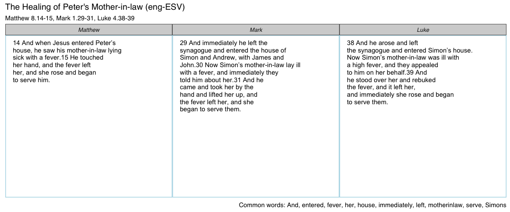
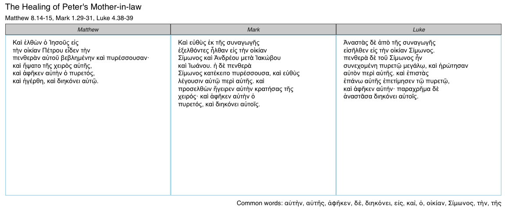

<!-- README.md is generated from README.Rmd. Please edit that file -->
ggtextparallels
===============

The goal of ggtextparallels is to approximate fancy and expensive tools like the *Synopsis Quattuor Evangeliorum*, an essential tool for biblical scholars. `ggtextparallels` supports both the English and Greek texts.

Installation
------------

`ggtextparallels` is not on CRAN, but can be installed with `devtools`:

``` r
devtools::install_github("daranzolin/ggtextparallels")
```

Examples
--------

The central function, `ggtextparallel`, takes two arguments: a `parallel_no`, which can be gleaned from `gospel_parallels`, and `lang`, the language argument.

156 gospel parallels are available:

    #>   No.                                     Pericope Matthew Mark    Luke
    #> 1   1                                     Prologue     1.1  1.1   1.1-4
    #> 2   2 The Promise of the Birth of John the Baptist               1.5-25
    #> 3   3                             The Annunciation              1.26-38
    #> 4   4                    Mary's Visit to Elizabeth              1.39-56
    #> 5   5                The Birth of John the Baptist              1.57-80
    #> 6   6                       The Genealogy of Jesus  1.2-17      3.23-38
    #>     John
    #> 1 1.1-18
    #> 2       
    #> 3       
    #> 4       
    #> 5       
    #> 6

English:

``` r
library(ggtextparallels)
ggtextparallel(37)
```



Greek:

``` r
ggtextparallel(37, lang = "grc")
```



Future Work
-----------

-   Tests
-   Vignette
-   Better organization of text
-   Highlighting similarities/differences
-   Document similarity scores in caption
