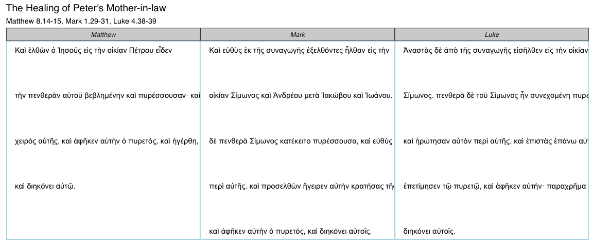

<!-- README.md is generated from README.Rmd. Please edit that file -->
ggtextparallels
===============

The goal of ggtextparallels is to approximate fancy and expensive tools like the *Synopsis Quattuor Evangeliorum*, an essential tool for biblical scholars. `ggtextparallels` supports both the English and Greek texts.

Examples
--------

English:

``` r
library(ggtextparallels)
ggtextparallel(37)
```


Greek

``` r
ggtextparallel(37, lang = "grc")
```


