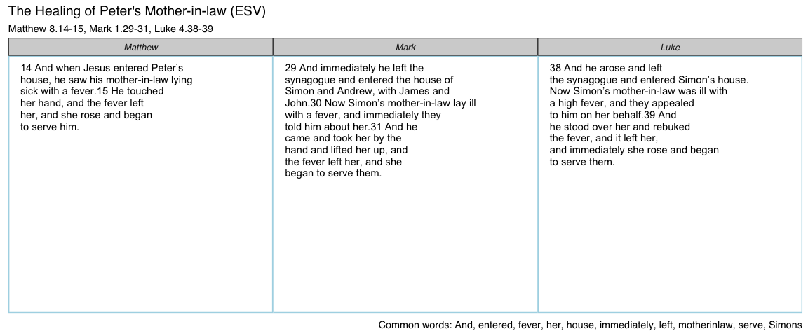

<!-- README.md is generated from README.Rmd. Please edit that file -->
ggtextparallels
===============

The goal of ggtextparallels is to approximate fancy and expensive tools like the *Synopsis Quattuor Evangeliorum*, an essential tool for biblical scholars. `ggtextparallels` supports both the English and Greek texts.

Installation
------------

`ggtextparallels` is not on CRAN, but can be installed with `devtools`:

``` r
devtools::install_github("daranzolin/ggtextparallels")
library(ggtextparallels)
```

Examples
--------

The central function, `ggtextparallel`, takes three arguments: a `parallel_no`, which can be gleaned from `gospel_parallels`, `version`, the language argument, and `words_per_row`, which allows users to adjust the amount of words displayed on each row.

156 gospel parallels are available:

    #> # A tibble: 156 x 6
    #>      No.                                        Pericope Matthew  Mark
    #>    <chr>                                           <chr>   <chr> <chr>
    #>  1     1                                        Prologue     1.1   1.1
    #>  2     2    The Promise of the Birth of John the Baptist              
    #>  3     3                                The Annunciation              
    #>  4     4                       Mary's Visit to Elizabeth              
    #>  5     5                   The Birth of John the Baptist              
    #>  6     6                          The Genealogy of Jesus  1.2-17      
    #>  7     7                              The Birth of Jesus 1.18-25      
    #>  8     8               The Adoration of the Infant Jesus  2.1-12      
    #>  9     9 The Circumcision and Presentation in the Temple              
    #> 10    10                The Flight into Egypt and Return 2.13-21      
    #> # ... with 146 more rows, and 2 more variables: Luke <chr>, John <chr>

Here I request the English, ESV translation of 'The Healing of Peter's Mother-in-Law':

``` r
ggtextparallel(parallel_no = 37, version = "eng-ESV", words_per_row = 6)
#> No encoding supplied: defaulting to UTF-8.
#> No encoding supplied: defaulting to UTF-8.
#> No encoding supplied: defaulting to UTF-8.
```



Words common to each pericope are listed in the plot caption.

I can view the Greek by flipping the `version` argument:

``` r
ggtextparallel(37, "grc", 5)
```


Future Work
-----------

-   Tests
-   Vignette
-   Better organization of text
-   Highlighting similarities/differences
-   Document similarity scores in caption
